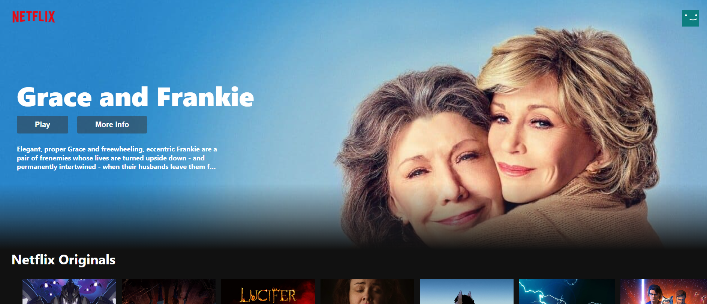
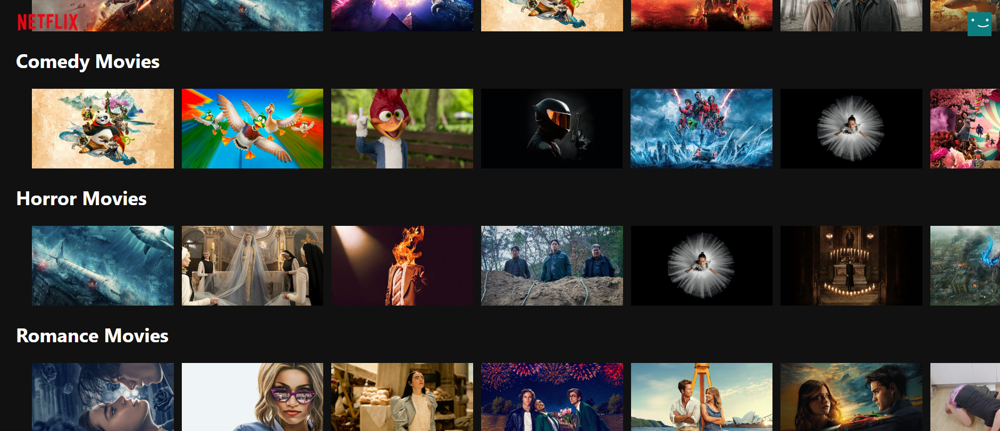

# Netflix App Clone

## Description
This project is a Netflix app clone built in React.js using the MovieDB API. It allows users to browse and search for movies and TV shows, view details about each title, and watch trailers.

## Features
- Browse trending movies and TV shows
- Search for specific titles
- View details about each title, including description, rating, and release date
- Watch trailers for movies and TV shows

## Installation
1. Clone the repository: git clone https://github.com/nishkarsh800/Movie-App.git
2. Navigate to the project directory: cd Movie-App
3. Install dependencies: npm install

## Usage
1. Obtain an API key from [The Movie Database (TMDb)](https://www.themoviedb.org/documentation/api) and replace YOUR_API_KEY in src/api/requests.js with your actual API key.
2. Start the development server: npm start
3. Open your browser and navigate to http://localhost:5173 to view the app.

## Technologies Used
- React.js
- JavaScript (ES6+)
- MovieDB API
- HTML5
- CSS3

## Credits
- This project utilizes the [MovieDB API](https://www.themoviedb.org/documentation/api).
- The app design and layout are inspired by the Netflix interface.

## Contributing
Contributions are welcome! Feel free to open an issue or submit a pull request.

## Screenshots

